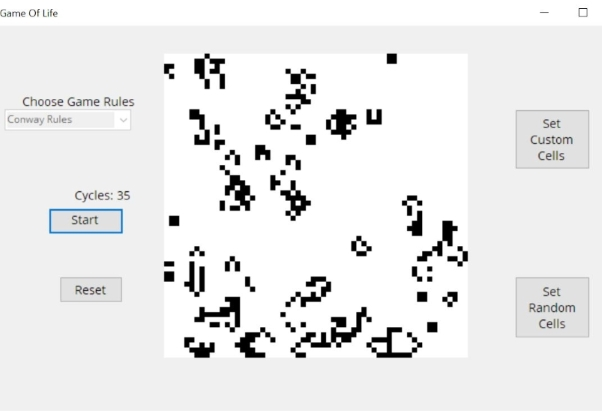
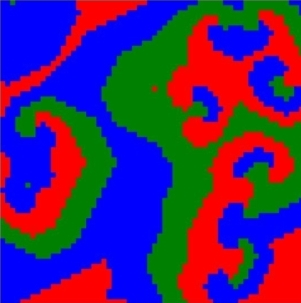
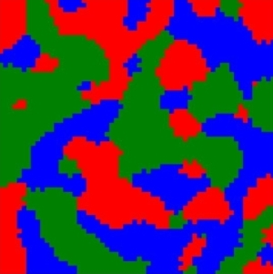

# Game of Life in C#

An object-oriented implementation of Conway’s Game of Life in .Net and C#. It runs classic ‘Conway’ rules, and two other three-colour game modes: ‘Largest Neighbour’, and ‘Cyclical Eating’.

Each game mode has unique evolution rules, which produce differing emergent ecologies of cells.

## Front End 

The front-end GUI is built in WinForms, with user controls for game mode selection, running/pausing the game, and setting cell states via custom selection and randomisation. 

### GUI - Classic ‘Conway’ Game of Life Mode

RGB 'Largest Neighbour' Mode          |  RGB 'Cyclical Eating' Mode
:-------------------------:|:-------------------------:
  |  

## Back End Architecture

The game mechanics are captured by three main objects:

- Grid
- Cell
- NeighbourStates

Cells have a state (colour), which updates based on their inherent evolution rules.

A Grid contains a matrix of Cells, and its `Cycle()` method evolves the overall Grid state in discrete time-steps. At each time-step, the Grid computes the ‘next state’ of each Cell, then updates all Cell states simultaneously.

NeighbourStates objects are used as DTOs, and transmit Cell neighbour data between the Grid and its individual Cells.

## Game Modes and Cell Evolution

Each cell has eight adjacent neighbours. Cells live, die or change state based on the evolution rules and the states of their neighbours.

Thus, cells both influence and are influenced by their neighbours, and complex ecological dynamics emerge.

### Conway Rules

Classical Game Of Life rules, a la its inventor, John Conway. Cells have two possible states: Dead (White) and Alive (Black). In each cycle, cells live or die by the following rules:

- Less than two live neighbours - cell dies
- Two live neighbours - cell's state does not change
- Three live neighbours - cell becomes live
- More than three live neighbours - cell dies 

### RGB ‘Largest neighbour’ Rules

Cells have four possible states: Dead (White), Red, Green and Blue.

In each cycle, all cells take the colour of the most common colour found among their immediate neighbours. Any ties for largest neighbour are resolved by random choice.

### RGB ‘Cyclical Eating’ Rules

#### Dead Cells

Dead cells change state according to the *Largest Neighbour* rules above.

#### Live Cells

Every colour has a ‘predator’ colour - Red eats Green eats Blue eats Red.

In each cycle, if a cell has three or more adjacent neighbours of its predator colour, it is ‘eaten’ by the predator and takes that colour. Otherwise, its state does not change.

## Installing Source Code and Running Tests

The code is packaged as a Visual Studio Winforms solution. Fork and clone this repo to your local machine, and open it in Visual Studio.

Unit tests for all back-end functionality game rules can be run from the Visual Studio Test Explorer.

The game itself can be run within Visual Studio, or compiled to an executable.
